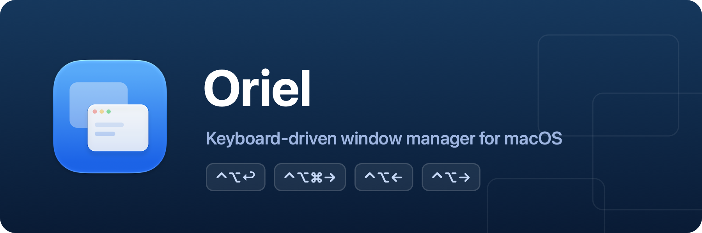

<p align="center">
  
</p>

<p align="center">
  A macOS menu bar app for moving and arranging windows with global keyboard shortcuts.<br />
  A single dependency-free Swift Package — builds with the <code>swift</code> CLI alone, no Xcode project required.
</p>

## Features

| Default shortcut | Action |
| --- | --- |
| `⌃⌥↩` | Maximize / restore previous size (toggle) |
| `⌃⌥⌘→` | Move to next display |
| `⌃⌥⌘←` | Move to previous display |
| `⌃⌥←` | Left half of the current display |
| `⌃⌥→` | Right half of the current display |

Display moves are smarter than a plain teleport:

- **Size is preserved** — the window is shrunk only if it's larger than the target screen.
- **Relative position is preserved** — the position is converted to a ratio of the *free space*
  (screen size − window size) within the screen's `visibleFrame`, and re-applied on the target
  screen. A centered window arrives exactly centered; a window flush against an edge stays
  flush against that edge.
- **Moves wrap around** — from the last display, "next" cycles back to the first.

## Settings

Open from the menu bar icon → **Settings…** (a System Settings–style sidebar window).

- **General** — launch at login, and hide the menu bar icon.
- **Shortcuts** — click any action's button and press a new combination; it is applied and
  saved immediately. Esc cancels, and at least one of ⌘ / ⌃ / ⌥ is required.

With the menu bar icon hidden, Oriel runs fully invisible. It appears in the Dock only while
the settings window is open, and launching Oriel again while it's running reopens Settings.

> [!NOTE]
> Launch at login requires the bundled app (`SMAppService` needs an app bundle). Settings live
> in UserDefaults, so `swift run` (non-bundled) and `build/Oriel.app` use separate domains and
> don't share them.

## Building the app

```sh
./Scripts/bundle.sh
open build/Oriel.app
```

Grant the Accessibility permission to **Oriel itself** when prompted. The bundle is ad-hoc
signed, so the permission survives rebuilds on this machine; distributing to other machines
requires a Developer ID signature plus notarization.

The app icon is compiled from the Icon Composer document at `Assets/AppIcon.icon` (generated by
`swift Scripts/make-assets.swift`), so on macOS 26+ the system renders it live with the Liquid
Glass treatment — including the dark, clear, and tinted variants.

### Release signing & notarization

The release workflow signs and notarizes automatically when these repository secrets exist
(without them, releases fall back to ad-hoc signing):

| Secret | Value |
| --- | --- |
| `DEVELOPER_ID_P12` | Developer ID Application certificate + private key, exported as `.p12` from Keychain Access, then base64-encoded (`base64 -i cert.p12`) |
| `DEVELOPER_ID_P12_PASSWORD` | Password chosen when exporting the `.p12` |
| `NOTARY_KEY_P8` | Contents of an App Store Connect API key (`.p8`, Developer role) |
| `NOTARY_KEY_ID` | The API key's Key ID |
| `NOTARY_ISSUER_ID` | The API key's Issuer ID |
| `SPARKLE_ED_PRIVATE_KEY` | Sparkle EdDSA private key (`generate_keys -x`) for signing auto-updates — must match `SUPublicEDKey` in `Scripts/Info.plist` |

### Auto-updates (Sparkle)

The app updates itself via [Sparkle](https://sparkle-project.org): it checks the feed at
`appcast.xml` on `main` (see `SUFeedURL` in `Scripts/Info.plist`). After publishing a release,
the workflow signs the notarized zip with the Sparkle private key and commits a new appcast
entry — no manual steps. The EdDSA keypair lives in the maintainer's login keychain (back it
up; losing it means existing installs can't verify future updates).

Sparkle is Developer-ID-distribution only — a future App Store variant must compile out
`UpdaterController.swift` and the Sparkle dependency (App Review 2.5.2 forbids self-updaters).

Local distributable builds work too: `CODESIGN_IDENTITY="Developer ID Application" ./Scripts/bundle.sh`
signs with hardened runtime + timestamp instead of ad-hoc.

## Development

```sh
swift run                  # run once
./Scripts/dev.sh           # rebuild & relaunch on source changes
./Scripts/dev.sh --settings  # same, with the settings window open
```

`dev.sh` polls `Sources/` and `Package.swift` once a second and swaps the app in when a build
succeeds (on failure the old instance keeps running — save to retry). Ctrl+C shuts everything
down. If you prefer an FSEvents-based watcher: `brew install watchexec`, then
`watchexec -r -e swift -- swift run Oriel`.

> [!IMPORTANT]
> For a process launched from a terminal, macOS attributes the Accessibility permission to the
> **terminal app** (the "responsible process") — enable your terminal (iTerm, Terminal,
> VS Code, …) under **System Settings → Privacy & Security → Accessibility**. After that,
> `swift run` never re-prompts, keeping the dev loop fast.
>
> If shortcuts do nothing, it's almost always this. Toggle the terminal off and on in the
> Accessibility list, or fully restart it — permission changes apply after a process restart.

### Manual test checklist

1. `swift run` → the menu bar icon appears.
2. Focus any window and try `⌃⌥←` / `⌃⌥→` — the half placements fail the least, so they're a
   good first check of permissions and coordinates.
3. `⌃⌥↩` twice — maximizes, then returns to the original size and position.
4. With 2+ displays, `⌃⌥⌘→` / `⌃⌥⌘←` — size preserved, relative position keeps its ratio,
   nothing lands off-screen on a smaller display.
5. Edge cases: vertically arranged displays, a Dock on only one monitor, fixed-size windows
   (resize may be refused, but the position must still move).

### Unit tests

```sh
./Scripts/test.sh   # equivalent to `swift test`
```

The display-move math (`ScreenMath.relativeReposition`) is a pure function, covered in
`Tests/OrielTests/`: center stays centered, edges stay flush, size is preserved, oversized
windows shrink, and a round trip returns to the original spot. Swift Testing needs full Xcode —
Command Line Tools alone won't run it.

## Code structure

```
Sources/Oriel/
├── main.swift                # Entry point (accessory app, no Dock icon)
├── AppDelegate.swift         # Permissions, shortcut wiring, menu bar item, Dock policy
├── HotKeyCenter.swift        # Carbon RegisterEventHotKey wrapper (global shortcuts)
├── ShortcutStore.swift       # Per-action shortcut specs + UserDefaults persistence
├── AppPreferences.swift      # App-level preferences (hide menu bar icon)
├── SettingsWindow.swift      # Sidebar settings window + shortcut recorder
├── AccessibilityWindow.swift # AXUIElement wrapper (focused window, frame get/set)
├── ScreenMath.swift          # Coordinate-system conversion (the crux!) + position math
└── WindowManager.swift       # The actual logic for the three features
```

Recommended reading order: `ScreenMath.swift` → `WindowManager.swift`.

All window coordinates are normalized to the AX API's coordinate system (origin at the
top-left of the primary display, y increasing downward). `NSScreen`'s Cocoa coordinates
(bottom-left origin) must go through `ScreenMath.flipped(_:)` before comparing with window
coordinates — 90% of multi-display bugs come from missing this conversion.

The settings UI is dependency-free AppKit. (It began under a Command Line Tools–only
environment, where the SwiftUI macro plugin isn't available; everything works, so it stayed.)
